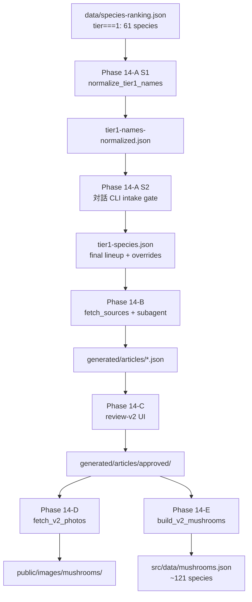

# Phase 14: v2 図鑑拡充（tier1 合成）設計書

作成日: 2026-04-16
対象ブランチ: 未定（実装時に `phase14-tier1-expansion` を切る予定）
前提: Phase 13-F/G 完了、v2.0 リリース済（60 種）

## 目的

v2 図鑑を tier0 の 60 種から tier1 を加えた **約 121 種** に拡充し、v2.1 として一括リリースする。

## スコープ決定事項（brainstorming で確定）

| 項目 | 決定 |
|---|---|
| 追加種数 | tier1 全件（61 種）、intake gate で数件減の見込み |
| 事前キュレーション | S1 和名正規化 → S2 ラインナップ確定 → S3 override 生成 |
| リリース単位 | v2.1 一括リリース |
| intake gate | 軽量（Wikipedia ja AND (大菌輪 OR iNat)） |

## 前提と既解決事項

### 学名（scientificName）— ✓ 解消済み（Phase 13-B'）
- `data/species-ranking.json` の tier1 全件が GBIF Backbone Taxonomy の accepted name に正規化済み
- 旧名は `originalNames[]` / `synonyms[]` に保持

### 和名（japaneseName）— ✗ tier1 は未解消
- 現状は日本産菌類集覧（日本菌学会 CC BY 4.0）由来のみ
- 大菌輪正典和名との突合は tier0 の 15 件のみ Phase 13-E で実施済
- checklist ノイズ（例: `"クモ　※クモタケ"`）が `japaneseNames[]` に混入
- ranking.json は `generatedAt: 2026-04-14`、Phase 13-A Hotfix（2026-04-15、大菌輪 pages.json 駆動化）より前

これが Phase 14-A S1（和名正規化）の直接の動機。

## 全体アーキテクチャ



## Phase 14-A: 事前キュレーション

### S1: 和名正規化モジュール

**パス**: `scripts/phase14/normalize_tier1_names.mjs`

**入力**: `data/species-ranking.json` から `tier===1` を抽出

**処理**:
1. `.cache/phase13/daikinrin-pages.json`（既存）を読み込み
2. 各種の `scientificName` で `lookupEntry` を呼び出し
3. 大菌輪エントリがあれば `daikinrin.title` と `japaneseName` を比較
4. 乖離があれば `overrides[]` に RENAME 候補として記録
5. `japaneseNames[]` から checklist ノイズを除去:
   - 全角スペース混入 (例: `"クモ　※クモタケ"`)
   - `"※"` で始まる注釈エントリ
   - 空文字・重複
6. intake gate 素材として `daikinrinHit: boolean` を付与

**出力**: `data/phase14/tier1-names-normalized.json`

```json
{
  "generatedAt": "2026-04-17T...",
  "source": "data/species-ranking.json (2026-04-14)",
  "species": [
    {
      "scientificName": "Trametes versicolor",
      "japaneseName": "アイカワラタケ",
      "cleanedJapaneseNames": ["アイカワラタケ", "カワラタケ", "クロクモタケ"],
      "daikinrinHit": true,
      "daikinrinTitle": "アイカワラタケ",
      "daikinrinScientificName": "Trametes versicolor",
      "suggestion": "KEEP",
      "signals": { /* ranking.json から引き継ぎ */ },
      "normalizationStatus": "ACCEPTED"
    },
    {
      "scientificName": "Aspergillus niger",
      "japaneseName": "クロカビ",
      "daikinrinHit": false,
      "suggestion": "EXCLUDE_NOT_MUSHROOM",
      "excludeReason": "子実体を形成しないカビ類"
    }
  ],
  "summary": { "total": 61, "daikinrinHit": 54, "renameCandidates": 8, "autoExcludeCandidates": 2 }
}
```

**suggestion の値**:
- `KEEP`: 和名・学名とも大菌輪と一致
- `RENAME_TO`: 大菌輪で別和名（`daikinrinTitle` に格納、後段で手動確認）
- `EXCLUDE_NOT_MUSHROOM`: キノコ対象外。自動判定条件は「genus が既知の非キノコ属リスト (`Aspergillus` / `Penicillium` / `Saccharomyces` 等のカビ・酵母属) に一致」。判定ロジックは `scripts/phase14/non-fungi-genera.mjs` に定数配列で持つ
- `NEEDS_REVIEW`: 大菌輪未ヒットで判断不能。S2 の対話 CLI で必ず 3 択判定にかかる

### S2: ラインナップ確定（対話 CLI）

**パス**: `scripts/phase14/confirm_lineup.mjs`

**intake gate 条件**（PASS 必須）:
- `signals.wikiJaExists === true`
- AND (`daikinrinHit === true` OR `signals.inatHasPhotos === true`)

**フロー**:
1. S1 出力を読み込み
2. gate FAIL 種と `suggestion != "KEEP"` 種を列挙
3. 各件について 3 択プロンプト（`readline` ベース）:
   - `e` = exclude（理由必須、メモに記録）
   - `f` = force_include（日本語メモ必須）
   - `d` = defer（Phase 15+ に回す、`deferredReason` 記録）
4. RENAME 候補は別フェーズで `accept` / `reject` / `custom` 3 択
5. 確定結果を `data/phase14/tier1-lineup-confirmed.json` に保存

**中断耐性**: autosave を 1 件毎。既存 json があれば再開。

### S3: tier1-species.json 生成

**パス**: `scripts/phase14/build_tier1_spec.mjs`

**出力**: `data/phase14/tier1-species.json`

- `data/phase13/tier0-species.json` と同 JSON schema
- フィールド:
  - `scientificName` (accepted)
  - `japaneseName` (S2 で確定したもの)
  - `aliases[]` (cleanedJapaneseNames から重複除去)
  - `ja_wiki_source_override?: { title: string, reason: string }`
  - `normalizationStatus: "ACCEPTED" | "SYNONYM" | "MANUAL"`
  - `synonyms[]` (ranking.json 由来)
  - `mycobank_id?: null`
  - `curator_notes?: string` (S2 で記録したメモ)

## Phase 14-B: AI 合成

### 実装

- `scripts/phase13/fetch_tier0_sources.mjs` に `--spec <path>` 引数を追加（**追加フラグ方式、改名なし**）
  - デフォルト値を従来の `data/phase13/tier0-species.json` に維持 → 後方互換
  - tier1 実行時は `--spec data/phase14/tier1-species.json` を渡す
  - 既存の unit test はデフォルト動作で引き続き動く
- validator V1-V13 は変更なし
- subagent 並列（concurrency 5）で Opus 4.6 に合成依頼
- prompt も変更なし（Phase 13-E で整備した extractHint / SOURCE_PRIORITY_BLOCK / SEASON ルール）

### 追加機能: `--skip-existing`

- 再開用フラグ。`generated/articles/<slug>.json` が既に存在する slug は skip
- 中断セッションの再開 + tier0 既存 60 件への再合成事故防止

### 出力

- `generated/articles/<slug>.json` に tier1 種を追記
- 既存 tier0 60 件は触らない（slug 衝突チェックは `--skip-existing` で担保）

## Phase 14-C: 人間レビュー

### 基本

- Phase 13-D の review-v2 UI（port 3031）をそのまま使用
- 現 UI は `generated/articles/*.json` を自動スキャン → tier1 分も自動表示
- approved 判定で `generated/articles/approved/<slug>.json` に自動コピー

### 小改修（任意）

- sidebar に `[tier0] [tier1] [all]` フィルタチップ追加
- 既 approve 済（tier0 60 件）を隠す切替
- 実装負荷が高ければ skip して tier1 分だけレビューモードで動かす運用も可

### 想定ラウンド数

- 1st round: 45-50 件 approve、残りを concern/reject
- 2nd round: concern 対応、差し替え/修正
- 3rd round: reject 確定と tier demote
- → 2-3 ラウンドで収束（S1 で和名揃え済のため tier0 より concern 少を期待）

## Phase 14-D: 画像取得

### 実装

- `scripts/phase13/fetch_v2_photos.mjs` をそのまま tier1 approved slug 群に実行
- CC ライセンスのみ採用、scientific_synonyms フォールバック既済
- 既存 tier0 画像（`public/images/mushrooms/*-hero.webp`）は触らない

### 期待 hit 率

| 指標 | tier0 実績 | tier1 想定 |
|---|---|---|
| Hero (Wikipedia) | 95.0% | 80% |
| iNat (any) | 96.7% | 90% |
| iNat (≥5) | 93.3% | 85% |

下方修正理由: tier1 には Wikipedia ja 記事ありでも図版なしの種が含まれる可能性。Google 画像検索リンクで補完する既存 UI で受容。

## Phase 14-E: mushrooms.json 再ビルド + リリース

### ビルド

- `scripts/phase13/build_v2_mushrooms.mjs` を tier0 + tier1 両 approved/ 対象で実行
- ID 付与ポリシー:
  - tier0 既存 60 種の `id` は **変更禁止**（bookmark / record の mushroom_id が生きているため）
  - tier1 新規種は既存 ID の末尾に追記
  - 実装: ビルド時に既存 mushrooms.json を読み込み、scientific_name をキーに ID を再利用
  - 新規種は slug ベースで ID 生成（既存と衝突しないことを unit test で検証）

### IndexedDB

- **migration 不要**。v3→v4 migration は Phase 13-F で済み、schema 変更なし
- 新規種の bookmark/record 登録は既存フロー通り

### UI / 告知

- `V2ReleaseBanner` を v2.1 向けに更新:
  - 文言: 「v2.1: tier1 の N 種を追加しました。」
  - localStorage key: `v2-release-seen` → `v2.1-release-seen`（新 key で既見ユーザーにも再告知）
- 設定 > お知らせ に v2.1 エントリ追加（tier0/tier1 の経緯、ソースクレジット）
- README.md の v2.0 リリース告知を更新（v2.1 の件数と追加種の代表例を追記）
- 外部告知（GitHub Release / SNS）は Phase 13-F と同じく Plan A（アプリ内のみ）で実施しない

## テスト方針

| 対象 | ファイル | 件数 |
|---|---|---|
| S1 和名正規化 | `scripts/phase14/normalize_tier1_names.test.mjs` | 8-10 |
| S2 ラインナップ CLI（pure ロジック） | `scripts/phase14/confirm_lineup.test.mjs` | 4-6 |
| S3 spec 生成 | `scripts/phase14/build_tier1_spec.test.mjs` | 6-8 |
| build_v2_mushrooms ID 衝突 | 既存 `.test.mjs` に追加 | +4-5 |
| mushrooms.test.ts 総数・synonyms | 既存テストに追加 | +2-3 |
| e2e `zukan.spec.ts` | tier1 slug 例（チチタケ等）の詳細ページ表示 | 改修のみ |

合計: 現在 455 → **目標 480 tests**

## リスクと戻しポリシー

| リスク | 対応 |
|---|---|
| tier1 で validator 失敗多発 | プロンプト調整で 2nd round。ダメなら該当種を tier demote |
| 画像取得 hit 率が 80% を大きく下回る | Google 画像検索リンクで補完、リリース進行 |
| 合成セッション中断 | `--skip-existing` フラグで resume、approved/ に既書き出し済みの articles は安全 |
| ビルド失敗 | tier0 既存 mushrooms.json はそのまま保持 → tier0 ロールバック可能 |
| ID 衝突 | build 時 assert + unit test で未然検出 |
| 既存ユーザー | DB migration 不要、bookmark/record は維持。新規種のみ出現 |

## Phase 構造と推定工数

```
Phase 14-A S1 (和名正規化 + テスト)      1 セッション
Phase 14-A S2 (ラインナップ確定 CLI)     1 セッション（対話）
Phase 14-A S3 (tier1-species.json)      0.5 セッション
Phase 14-B   (AI 合成)                  1-2 セッション（subagent 並列）
Phase 14-C   (人間レビュー 2-3 round)   1-2 セッション（対話）
Phase 14-D   (画像取得)                 1 セッション
Phase 14-E   (ビルド + リリース)         1 セッション
```

**合計**: 6-8 セッション（tier0 Phase 13 全体と同規模）

## 合意済み外部仕様

- `data/phase14/` 配下に中間生成物を置く（実装時に gitignore 対象外として入れる）
- `scripts/phase14/` に新規スクリプトを置く（Phase 13 配下は変更最小限）
- Phase 13 のスクリプトへの変更は `--spec`/`--skip-existing` 等の後方互換なフラグ追加のみ
- DESIGN.md / CLAUDE.md のガードレールに変更なし

## 次ステップ

本設計書の承認後、`superpowers:writing-plans` スキルを呼んで実装計画書（タスク分割、順序、受け入れ条件）を `docs/superpowers/plans/2026-04-16-phase14-tier1-expansion.md` に作成する。
